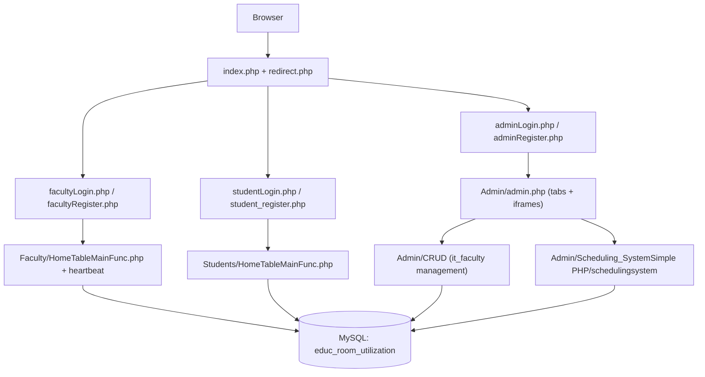
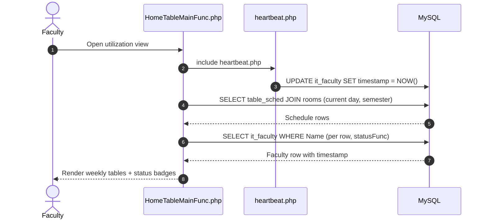

# ARCHITECTURE: System Architecture

> **Purpose:** Describe the high-level architecture, module boundaries, data flows, client/server structure, and cross-cutting concerns so developer decisions align with system integrity. Tier-3 template, filled in for this project.

_Last updated: September 29, 2026_

---

## 1. System Overview & High-Level Architecture

The system is a server-rendered PHP 8.0 web application backed by a single MySQL/MariaDB database named `educ_room_utilization`. It has no framework, no Composer dependency manager, and no MVC separation. Each page is one PHP file that mixes HTML output, database queries, and inline JavaScript.

- **Entry Topology:** One public entry point (`index.php`) routes role selection (Admin, Faculty, Student) through `redirect.php` to per-role login pages.
- **Portal Topology:** Three role portals: Admin dashboards (`Admin/admin.php`, `Admin/ad.php`), Faculty view (`Faculty/HomeTableMainFunc.php`), Student view (`Students/HomeTableMainFunc.php`).
- **Data Topology:** Per-request `mysqli` or PDO connections created from constants in per-module `config.php` files. No ORM, no connection pooling.

### Architecture Diagram



---

## 2. Layered Architecture & Conventions

The codebase has no formal layered pattern. Pages mix presentation and data access in one file. The de facto layering:

- **Entry / Auth Layer:** Root login and register pages. They validate credentials, set `$_SESSION['username']`, and redirect.
- **Shared Includes Layer:** `rsuHeader.php` and `footer.php` (root), `Faculty/header.php`, `Faculty/logo.php`, `Faculty/heartbeat.php`, and per-module `config.php` files.
- **Dashboard Renderer Layer:** The Faculty and Students copies of `HomeTableMainFunc.php`. They query `table_sched` joined with `rooms` and render weekly tables and status lists.
- **Admin Subsystem Layer:** `Admin/CRUD` (faculty records), `Admin/CRUD_ForBlocks` (near duplicate), `Admin/HomeMainFunc` (schedule setting), and `Admin/Scheduling_SystemSimple PHP/schedulingsystem` (lists, CSV, PDF).

---

## 3. Directory & Domain Structure

```
root/
├── index.php, redirect.php            # Entry and role routing
├── adminLogin.php, adminRegister.php
├── facultyLogin.php, facultyRegister.php
├── studentLogin.php, student_register.php
├── rsuHeader.php, footer.php, config.php
├── db/educ_room_utilization.sql       # Current schema + seed dump
├── Admin/
│   ├── admin.php, ad.php              # Dashboard shells (tab switching)
│   ├── CRUD/                          # Faculty CRUD (canonical)
│   ├── CRUD_ForBlocks/                # Near duplicate of CRUD
│   ├── HomeMainFunc/                  # Schedule setting (legacy DB name)
│   └── Scheduling_SystemSimple PHP/schedulingsystem/
├── Faculty/
│   ├── HomeTableMainFunc.php          # Utilization view + heartbeat
│   ├── heartbeat.php, heartbeat.js, logo.php
│   └── config.php, header.php, footer.php
└── Students/
    ├── HomeTableMainFunc.php          # Same view, heartbeat disabled
    └── config.php, header.php, footer.php, logo.php
```

- **Module Boundary Rules:** `Admin/CRUD` is the canonical faculty CRUD. `Admin/CRUD_ForBlocks` duplicates it. Edit the canonical module unless the task names the duplicate. Do not add new duplicated module copies.

---

## 4. Middleware & Request Pipeline

No formal middleware exists. The observed request pipeline:

- **Step 1:** Page loads. `session_start()` runs on login and heartbeat pages only.
- **Step 2:** POST handlers read `$_POST` values directly.
- **Step 3:** Database queries run (prepared statements or string interpolation, mixed).
- **Step 4:** `header('Location: ...')` redirects, or inline HTML and JavaScript alerts render.
- **Step 5:** The `footer.php` include closes the page.

---

## 5. Client-Side Architecture

- **View Layer:** Server-rendered HTML with inline `<style>` blocks per page.
- **Libraries:** Bootstrap 3.3.7 and 4.0.0 via CDN, jQuery 2.2.0, 3.2.1, and 3.3.1, Font Awesome 5.x, Google Fonts, html2pdf.js 0.10.1, and local jQuery UI 1.10.4 in the scheduling subsystem.
- **Inline Behaviors:** Client-side table search, start-time sorting, refresh, view switching (`myFunction()`), tab switching (`openTab()`), password visibility toggles, and logout confirmations.
- **Embedding:** Admin dashboards embed subsystem pages through `<iframe>` elements.

---

## 6. Data Layer & Database Strategy

- **Connection Management:** Every page creates its own connection from the `DB_SERVER`, `DB_USERNAME`, `DB_PASSWORD`, and `DB_NAME` constants. Five `config.php` copies hold identical values: localhost, root, empty password, `educ_room_utilization`.
- **Access Style:** Mixed `mysqli` (procedural and OOP) and PDO. No ORM, no query builder.
- **[PLACEHOLDER: Standardize one access style (mysqli or PDO) and one shared connection include]**

---

## 7. Authentication & Authorization Flow

- **Auth Mechanism:** PHP native sessions. Passwords hash through `password_hash()` (PASSWORD_DEFAULT, bcrypt) and verify through `password_verify()`.
- **Admin:** `admin_register` lookup with a prepared statement. Registration requires the name to exist in `it_faculty` and caps accounts at 3.
- **Faculty:** `it_faculty` lookup through string interpolation. Registration sets a password only when the row has none.
- **Student:** `student` lookup with a PDO prepared statement. Registration requires the name to exist in `exprimental_studentlist`.
- **Authorization Model:** None beyond login. Dashboard pages do not guard the session. **[PLACEHOLDER: Define the intended session guard and page protection policy]**

---

## 8. Key Data Flows & Sequence Diagrams



- **Login Flow:** Login page POST, credential verify, session set, redirect to the role dashboard.
- **Presence Flow:** `heartbeat.js` polls `heartbeat.php`, which refreshes `it_faculty.timestamp`. The Students copy disables it.

---

## 9. Domain Logic Highlights

- **statusFunc() Status Rules (Asia/Manila timezone):** A timestamp gap larger than 0 days or 900 minutes renders red: `Vacant N day(s)` for day gaps, `Unavailable X min/hr(s)` within 15 hours. Otherwise the current time is compared with `Start_Time` and `End_Time`: inside renders green `Active`, outside renders blue `Inactive`. A missing faculty row renders `No Faculty`.
- **getQuarter() Semester Mapping:** Months 8 through 12 return `1st Sem`, months 1 through 5 return `2nd Sem`, otherwise `Vacation`.
- **Schedule Matrix:** `table_sched` holds one row per block, subject, room, and time range. Day columns (`Monday` through `Sunday`) hold `green` or `red`. `createSchedulTable()` renders one weekly table per room. `roomScheduleTable()` renders the block and faculty list.

---

## 10. Cross-Cutting Concerns

- **Error Handling:** `die("Connection failed: ...")` on connection errors, inline JavaScript `alert()` on auth failures, raw `$conn->error` echoes elsewhere.
- **Security:** Hardcoded credentials in five `config.php` files, SQL string interpolation in `facultyLogin.php`, `Faculty/heartbeat.php`, and `statusFunc()`, no CSRF tokens, and no session guards on dashboards. See `context/RULES.md` for the required fixes.
- **Logging:** None. **[PLACEHOLDER: Decide on logging and monitoring requirements]**
- **Performance:** Per-request connections and per-row status queries. Acceptable at the current scale. **[PLACEHOLDER: Define performance requirements if scale grows]**