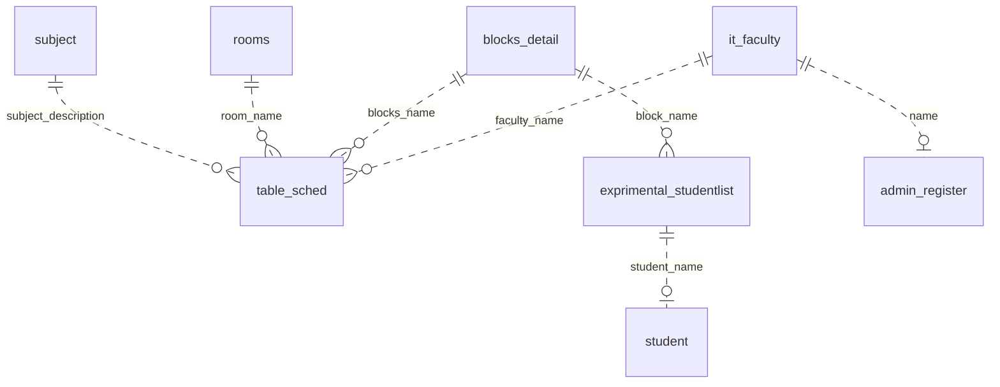

# SCHEMA: Database & API Schema

> **Purpose:** Document the database structure, table definitions, relationships, security policies, and API contracts so developers and AI agents query and manipulate data safely without guessing schema details. Tier-3 template, filled in for this project.

_Last updated: September 29, 2026_

---

## 1. Data Layer Overview

- **Primary Database:** MySQL/MariaDB, database `educ_room_utilization`. Source of truth: `db/educ_room_utilization.sql` (phpMyAdmin 5.2.1 dump from MariaDB 10.4.28, generated 2023-10-03).
- **Engine & Charset:** All tables use InnoDB with `utf8mb4_general_ci`.
- **No ORM, No API Layer:** Pages query the database directly. Form POSTs replace REST endpoints.
- **Root Dump Note:** `u129841553_educ_room_util.sql` at the repo root has a different file hash, so treat `db/educ_room_utilization.sql` as the current dump.

---

## 2. Database Tables & ER Diagram

Relationships exist by name reference only. The dump declares no foreign key constraints.



---

## 3. Table Schemas & Column Definitions

### Table: `it_faculty` (faculty records and presence heartbeat)

| Column | Type | Nullable | Default | Notes |
| :--- | :--- | :--- | :--- | :--- |
| `id` | `int(11)` | No | AUTO_INCREMENT=19 | Primary Key |
| `Name` | `varchar(255)` | No | None | Login name and schedule join key |
| `Academic_Rank` | `varchar(255)` | No | None | for example Instructor I, Lecturer |
| `Advisory` | `varchar(255)` | No | None | Block advisory assignment |
| `password` | `varchar(250)` | Yes | NULL | bcrypt hash, absent until registration |
| `timestamp` | `timestamp` | No | `current_timestamp()` ON UPDATE | Presence heartbeat, refreshed by `heartbeat.php` |

### Table: `table_sched` (schedule matrix)

| Column | Type | Nullable | Default | Notes |
| :--- | :--- | :--- | :--- | :--- |
| `id` | `int(11)` | No | AUTO_INCREMENT=50 | Primary Key |
| `faculty` | `varchar(250)` | No | None | References `it_faculty.Name` by name |
| `blocks` | `varchar(250)` | No | None | References `blocks_detail.name` by name |
| `subject` | `varchar(250)` | No | None | Subject description |
| `room` | `varchar(250)` | No | None | References `rooms.room` by name |
| `Monday` through `Sunday` | `varchar(250)` x 7 | No | `'red'` | Day columns hold `green` or `red` |
| `Start_Time` | `time` | No | None | Class start time |
| `End_Time` | `time` | No | None | Class end time |
| `Semester` | `varchar(255)` | Yes | NULL | for example `1st Sem` |

### Compact definitions for the remaining tables

| Table | Columns |
| :--- | :--- |
| `admin_register` | `id` int(11) PK AUTO_INCREMENT=6, `name` varchar(255) NOT NULL (must match an `it_faculty.Name` at registration), `password` varchar(255) NOT NULL (bcrypt hash) |
| `blocks_detail` | `id` int(11) PK AUTO_INCREMENT=8, `name` varchar(255) NOT NULL, `year_level` varchar(255) NOT NULL, `advisor` varchar(255) NOT NULL |
| `exprimental_studentlist` | `id` int(11) PK AUTO_INCREMENT=8, `Name` varchar(255) NOT NULL, `block` varchar(255) NOT NULL (official student roster, table name carries a typo) |
| `rooms` | `id` int(11) PK AUTO_INCREMENT=16, `room` varchar(255) NOT NULL (13 venues: 201, 202, 203, 205, 206, 103, 102 - OSAS Office, Backstage, Defense Room, Canteen, Covered Court, Stage, none) |
| `student` | `id` int(11) PK AUTO_INCREMENT=6, `student_name` varchar(255) NULL, `blocks` varchar(255) NULL, `year_level` varchar(255) NULL, `password` varchar(255) NULL (bcrypt hash) |
| `subject` | `subject_id` int(11) PK AUTO_INCREMENT=30, `subject_code` varchar(250) NOT NULL, `subject_description` varchar(250) NOT NULL |

---

## 4. Row-Level Security (RLS) & Access Policies

The database declares no row-level security and no roles beyond the connection user. Access control happens at the application layer, and the audit found gaps (dashboard pages without session guards). The intended policies:

- **Table `admin_register`:** **[PLACEHOLDER: Define who can create admin accounts and how]**
- **Table `student`:** **[PLACEHOLDER: Define who can create student accounts]**
- **Table `table_sched`:** **[PLACEHOLDER: Define who can insert, update, and delete schedules]**
- **Table `it_faculty`:** **[PLACEHOLDER: Define who can manage faculty records and passwords]**

---

## 5. API Routes by Domain

The application exposes no REST or GraphQL API. Form POSTs act as the endpoints:

### Domain: Auth & Users (repo root)

- `POST adminLogin.php` with `username`, `password`. Verifies against `admin_register`, redirects to `Admin/admin.php`.
- `POST adminRegister.php` with `name`, `password`. Gated by `it_faculty` membership and the 3 account cap.
- `POST facultyLogin.php` with `advisor`, `password`. Verifies against `it_faculty`, redirects to `Faculty/HomeTableMainFunc.php`.
- `POST facultyRegister.php` with `name`, `password`. Sets a password only when the row has none.
- `POST studentLogin.php` with `username`, `password`. Verifies against `student`, redirects to `Students/HomeTableMainFunc.php`.
- `POST student_register.php` with `name`, `blocks`, `password`. Gated by `exprimental_studentlist` membership.

### Domain: Presence

- `GET Faculty/heartbeat.php` (polled by `heartbeat.js`). Updates `it_faculty.timestamp` to `NOW()` for the session user.

### Domain: Admin Management

- `Admin/CRUD/`: `create.php`, `read.php`, `update.php`, `delete.php`, `deletePass.php` manage `it_faculty`.
- `Admin/HomeMainFunc/`: `add.home.php`, `update.php`, `timelist.php` manage schedules.
- `Admin/Scheduling_SystemSimple PHP/schedulingsystem/`: `addcourse.php`, `addroom.php`, `addsubject.php`, `addStudent.php`, `registerStudent.php`, `processCSV.php` (CSV import into `exprimental_studentlist`), `updateFacName.php`, `updateBlock.php`, `updateBlockAndFac.php`, `updateSub.php`, `delete.php`, `generate-pdf.php`, and list views (`list.php`, `tablelist.php`, `roomlist.php`, `faclist.php`, `sublist.php`, `studentList.php`, `roomListSchedule.php`, `timelist.php`).

---

## 6. Request & Response Payload Examples

### Request: `POST student_register.php` (form fields)

```text
name: Juan Dela Cruz
blocks: BSED 3 ENGLISH
password: [hashed before insert]
```

### Success Response

```text
<script>window.location.href = 'studentLogin.php?success=1';</script>
```

### Failure Responses (inline alerts)

```text
<script>alert('You are not allowed to insert data!');</script>
<script>alert('Name not found in the other table!');</script>
<script>alert('Registration Failed!');</script>
```

---

## 7. Phase-Based Route Priority

**[PLACEHOLDER: Specify implementation priority across delivery phases.]**

- **Phase 1 (MVP):** **[PLACEHOLDER: core flows to stabilize first, for example security fixes in `context/TASKS.md` section 2]**
- **Phase 2 (Enhancement):** **[PLACEHOLDER: feature work]**
- **Phase 3 (Scale):** **[PLACEHOLDER: performance and automation]**

---

## 8. Migrations & Schema Versioning

- **Current State:** One phpMyAdmin dump holds the schema and seed data (`db/educ_room_utilization.sql`). No migration tooling exists. The root dump `u129841553_educ_room_util.sql` is an alternate export with a different hash.
- **Rule:** Never modify the existing dumps. Version schema changes as new SQL files.
- **[PLACEHOLDER: Decide on the migration tool, file naming convention, and execution strategy]**